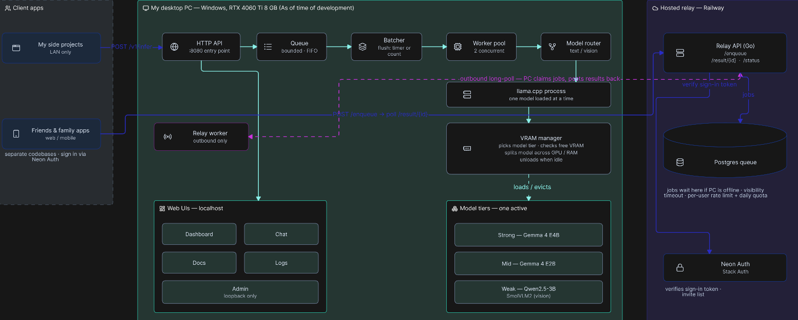

# Home Inference Server

I built this so I'd stop paying per-token for hosted APIs (Groq, Mistral, and the
like). Every small project I make now points at this one endpoint on my desktop —
no new Gemini project or API key per app, no keys to keep out of client code, no
extra cloud AI account to babysit. Friends and family can use those apps too,
signed in through Neon Auth, whether or not my PC is on.

Rather than just a `llama.cpp` wrapper, I built a serving layer around it: a
request queue, a continuously-batched worker pool, and a scheduler that trades
model quality for speed under live GPU pressure, plus a hosted relay that makes it
reachable when the machine is off. Concretely:

- **Serves several requests at once** through a continuously-batched worker pool,
  not one at a time.
- **Shares the GPU with whatever else I'm doing.** Each request carries a
  priority and a quality floor; when VRAM gets tight the server drops to a
  smaller model or spills layers to system RAM, then climbs back to full quality
  on its own when the pressure lifts. It doesn't OOM.
- **Uses zero VRAM when idle.** The model unloads seconds after the last request
  and reloads on the next — so it can run 24/7 alongside normal desktop use.
- **Survives the PC being off.** Requests queue on a small hosted relay and drain
  when the machine comes back; apps use the same API either way.

---

## Architecture

Left to right: my apps hit the local server on the LAN, requests flow through the
pipeline to whichever model is loaded, and anything from outside the house goes
via a hosted relay that my PC pulls work from. Details below.



### How it works

**Batching.** Requests queue up and get flushed together on a short timer (or
once enough have piled up), then a small pool of workers runs them through one
`llama.cpp` process that decodes several at once. Two concurrent by default,
tunable with `HIS_MAX_PARALLEL`. Streaming requests skip the queue for latency
but count against the same concurrency limit.

**Model tiers + VRAM.** Three models — strong / mid / weak — one loaded at a
time. Before each load the server checks how much VRAM is actually free and picks
the largest model that still fits, pushing the overflow onto system RAM if it has
to. When nothing's been asked for in ~20 seconds the model unloads and VRAM goes
back to zero; the next request reloads against whatever's free then, so opening
or closing a game just changes what loads next. Leftover model processes from a
crash get cleaned up on startup and can't outlive the server.

**Pressure policy.** Each request can set a `priority` (how urgent) and a
`min_tier` (lowest quality it'll accept). The server watches its own token/sec
rate and, if it drops below the floor for that priority, moves to a smaller
model — unless `min_tier` says not to, in which case the request waits. If VRAM
and CPU are both slammed, low/normal-priority requests are held until things
recover (or handed to the hosted queue so they survive a restart); high-priority
ones are served on the weak model with an `X-Quality-Degraded` header and a tray
notification. The exact thresholds are in `GET /docs`.

**Offline + friends and family.** Apps built against this never talk to my PC
directly — they hit a small hosted service (Go + Postgres on Railway), and my PC
pulls work from it over an outbound connection (so nothing at home is exposed to
the internet). If the PC is online the result comes back in seconds; if it's off,
the request sits in the queue and runs on reconnect — the app just shows "PC
offline, will process later" and keeps polling. Sign-in is handled by Neon Auth;
only people on an invite list can get through, and there are per-user rate limits
and a daily cap so a leaked token can't run up the bill.

---

## The two deployables

| Deployable                 | Entry point   | Runs on                   | Serves                                                                                |
| -------------------------- | ------------- | ------------------------- | ------------------------------------------------------------------------------------- |
| **Local inference server** | `cmd/server`  | the GPU box (Windows)     | `/v1/*`, dashboard, chat UI, `/docs`, `/logs`, loopback admin                         |
| **Hosted relay**           | `cmd/railway` | Railway (24/7, paid plan) | `/enqueue`, `/result/{id}`, `/status` for remote clients; the PC worker long-polls it |

Remote access is layered on top without touching the local inference server or
the `/v1/infer` contract.

---

## Model roster

| Tier       | Model (GGUF)               | Weight  | Vision | Role                                          |
| ---------- | -------------------------- | ------- | :----: | --------------------------------------------- |
| **Strong** | Gemma 4 E4B Q4_K_M         | ~4.7 GB |   —    | Primary under normal conditions               |
| **Mid**    | Gemma 4 E2B Q4_K_M         | ~3.0 GB |   —    | Moderate-pressure fallback (same family)      |
| **Weak**   | Qwen2.5-VL-3B-Instruct Q4_K_M | ~1.8 GB (+0.8 GB mmproj) | ✓ | Text last resort *and* the only vision-capable tier — a natively multimodal model, so it answers image questions directly instead of through a separate captioning hop |

These were picked for bang for buck on my 8 GB card — the most capable model at
each size that still leaves room to run. Weight sizes aren't hard VRAM
requirements: the model splits across GPU VRAM and system RAM, more on the GPU
being faster. The weak tier's vision projector (`--mmproj`) is only loaded for
a request that actually carries an image — a plain text request costs nothing
extra. Specialist models (OCR, audio, code) can be added in later.

---

## Quick start

### information after this section is if anyone wanted to copy my setup, but mostly to serve as my living documentation as i maintain the server

```sh
# fake inference — no GPU, no models, for trying the API / CI
go run ./cmd/server --backend=stub

# real inference
go run ./cmd/server
```

Real inference needs:

- `C:\llama\llama-server.exe` (llama.cpp b10696+, CUDA build)
- `nvml.dll` in `System32` (ships with the NVIDIA driver)
- The GGUF model files in `models\`:
  `gemma-4-e4b-q4_k_m.gguf`, `gemma-4-e2b-q4_k_m.gguf`,
  `qwen2.5-vl-3b-instruct-q4_k_m.gguf` +
  `mmproj-qwen2.5-vl-3b-instruct-q8_0.gguf` (the weak tier's vision projector)

From another terminal:

```sh
go run ./cmd/testapp -addr http://localhost:8080 -stub doctor   # conformance checklist
go run ./cmd/testapp -addr http://localhost:8080 chat "hello"   # streaming chat turn
```

Then open:

| URL                               | What                                                    |
| --------------------------------- | ------------------------------------------------------- |
| <http://localhost:8080/docs>      | full API reference (field-by-field)                     |
| <http://localhost:8080/dashboard> | live status — queue depth, loaded tier, VRAM, in-flight |
| <http://localhost:8080/chat>      | multi-turn chat UI with exact context-window accounting |
| <http://localhost:8080/logs>      | structured event log viewer                             |
| <http://localhost:8080/admin>     | drain / resume / restart buttons (**loopback only**)    |

---

## HTTP API

Full field reference at `GET /docs`. Summary:

| Method                      | Path                                         | Purpose                                                        | Auth                                                 |
| --------------------------- | -------------------------------------------- | -------------------------------------------------------------- | ---------------------------------------------------- |
| `POST`                      | `/v1/infer`                                  | inference — blocking JSON, or SSE stream with `"stream": true` | `X-API-Key` if `HIS_API_KEY` set (non-loopback only) |
| `GET`                       | `/v1/status`                                 | full status: queue depth, loaded model, in-flight, job history | —                                                    |
| `GET`                       | `/v1/status/pressure`                        | cheap snapshot: VRAM, CPU %, tok/sec, active tier, in-flight   | —                                                    |
| `POST`                      | `/v1/tokenize`                               | exact token count + `n_ctx` for a string                       | —                                                    |
| `GET`                       | `/v1/model/props`                            | `{ n_ctx }` of the loaded model                                | —                                                    |
| `GET`/`POST`/`PUT`/`DELETE` | `/v1/chats`, `/v1/chats/{id}`                | server-side conversation storage (up to 5)                     | —                                                    |
| `GET`                       | `/v1/logs`                                   | structured event log (ring buffer)                             | —                                                    |
| `POST`                      | `/v1/admin/drain` \| `/resume` \| `/restart` | maintenance control                                            | **loopback only** — `404` from any other IP          |
| `GET`                       | `/v1/admin`                                  | read-only state probe `{state, in_flight, queue_depth}`        | **loopback only**                                    |
| `GET`                       | `/healthz`                                   | `{status, version, uptime_s}` — `200` even while draining      | —                                                    |

```sh
# blocking
curl -s localhost:8080/v1/infer -H 'content-type: application/json' -d '{
  "modality": "text",
  "text_input": { "prompt": "Summarise in one line: ..." },
  "priority": "normal", "min_tier": "weak"
}'

# streaming (SSE: data: {"delta": "..."} per chunk, final chunk done:true)
curl -N localhost:8080/v1/infer -H 'content-type: application/json' -d '{
  "modality": "text",
  "text_input": { "messages": [{ "role": "user", "content": "Why is the sky blue?" }] },
  "stream": true
}'
```

**Request fields beyond the basics:** `priority`, `min_tier`, `stream`,
`timeout_ms`, `system_prompt`.
**Response fields:** `tokens_per_sec`, `queue_wait_ms`, `inference_ms`,
`deferred`, plus the `X-Quality-Degraded` header.
**Error codes** (`error_code` in the body): `invalid_request`,
`invalid_modality`, `unauthorized`, `overloaded`, `model_load_failed`,
`internal_error`, `unavailable`, `timeout`, `rate_limited`, `quota_exceeded`,
`queue_full`, `not_found`, `draining`, `not_implemented`, `reasoning_exhausted`.

### Relay contract (friends-and-family apps)

```
POST /enqueue   { correlation_id, payload }   -> 201 { id }
GET  /result/{id}                             -> 200 { status, result_payload?, error_code? }
GET  /status                                  -> 200 { pc_connected, last_claim_at, pending_depth }
```

`status` is `pending | processing | done | failed`. Auth:
`Authorization: Bearer <neon-auth-access-token>` (web) or `X-API-Key` (native /
CLI / PC worker). A valid token for a non-invited user → `403`.

---

## Using it from your own app

```go
import "github.com/ngkaichong/home-inference-server/hisclient"

c := hisclient.New("http://localhost:8080")
res, _ := c.Infer(ctx, api.InferRequest{
    Modality:  api.ModalityText,
    TextInput: &api.TextInput{Prompt: "Summarise this in one line: ..."},
})
fmt.Println(res.Output)
```

`hisclient` covers every documented endpoint (blocking + streaming infer, status,
logs, tokenize, chats CRUD) and a `RelayClient` for the hosted relay. See
`cmd/testapp` for worked examples and `internal/testapp` for a conformance suite
you can point at any running server
(`HIS_TESTAPP_ADDR=... go test ./internal/testapp/`).

---

## Configuration (`cmd/server`)

All env vars optional. Full annotated list in `.env.example`.

| Var                                           | Default                                      | Purpose                                                                                                                                                            |
| --------------------------------------------- | -------------------------------------------- | ------------------------------------------------------------------------------------------------------------------------------------------------------------------ |
| `PORT`                                        | `8080`                                       | listen port                                                                                                                                                        |
| `HIS_BIND_ADDR`                               | `:PORT` (all interfaces)                     | e.g. `127.0.0.1:8080` to restrict to localhost                                                                                                                     |
| `HIS_API_KEY`                                 | _(unset)_                                    | when set, non-loopback callers to `/v1/*` must send `X-API-Key`. Unset = unauthenticated (fine on a trusted LAN)                                                   |
| `HIS_CORS_ORIGINS`                            | _(unset)_                                    | comma-separated browser Origin allow-list; unset = CORS disabled                                                                                                   |
| `HIS_MAX_PARALLEL`                            | `2`                                          | concurrent-inference degree — `llama-server --parallel`, the semaphore cap, and the worker count. **Set to `1` on an 8 GB card if you mostly use the strong tier** |
| `HIS_INFER_TIMEOUT_MS`                        | `600000`                                     | per-request inference deadline when `timeout_ms` is omitted                                                                                                        |
| `HIS_CTX_SIZE`                                | `4096`                                       | `llama-server --ctx-size` (⚠ roster KV estimates assume 4096)                                                                                                      |
| `CHATS_DIR`                                   | `%LOCALAPPDATA%\home-inference-server\chats` | persisted conversations                                                                                                                                            |
| `RAILWAY_QUEUE_URL` / `RAILWAY_QUEUE_API_KEY` | _(unset)_                                    | enables the offline-queue worker **and** durable deferral under pressure. Unset = LAN-only. Can also come from `config.json`                                       |

Flags: `--backend=llamacpp|stub`, `--chats-dir <path>`.

Relay (`cmd/railway`) reads `DATABASE_URL` (Postgres), `QUEUE_API_KEY`, and — for
the Neon Auth Bearer path — `STACK_JWKS_URL` + `STACK_PROJECT_ID`, plus optional
`RESULT_TTL_SECONDS` / `MAX_PENDING_DEPTH` / `RATE_PER_MIN` / `DAILY_QUOTA` /
`MAX_BODY_BYTES` (code defaults in `internal/railwayq/config.go`).

---

## Deployment

- **Local server** — I run it as a Windows Task Scheduler _At log on_ task (not a
  boot service: the system tray needs an interactive desktop and can't run in
  session 0). Build with `-ldflags "-s -w"`, put the exe + `models\` on the box,
  point `RAILWAY_QUEUE_URL` / `RAILWAY_QUEUE_API_KEY` at the relay, register the
  task. Then: reboot, log in, and LAN + remote apps work with no terminal open.
- **Relay** — standard Railway deploy of `cmd/railway`
  (`go build -o /app/relay ./cmd/railway`), pointed at a Postgres database. I use
  Neon, sharing it with Neon Auth so `jobs` / `usage` / `allowed_members` sit
  alongside `neon_auth.users_sync`.

### Runtime control (no `sc stop/start`)

The server has loopback-only admin endpoints — `curl` from the box, or the
`/admin` button page:

| Call                     | Effect                                                                                                                             |
| ------------------------ | ---------------------------------------------------------------------------------------------------------------------------------- |
| `POST /v1/admin/drain`   | new `/v1/infer` → `503 draining`; offline worker stops claiming; in-flight finishes; model idle-evicts, freeing the GPU for a game |
| `POST /v1/admin/resume`  | back to serving                                                                                                                    |
| `POST /v1/admin/restart` | drain, 15 s shutdown, write `restart.flag`, exit 0 — a launcher loop re-execs the (possibly freshly staged) binary                  |

---

## Requirements

|               |                                                                                                                                 |
| ------------- | ------------------------------------------------------------------------------------------------------------------------------- |
| **GPU**       | NVIDIA, NVML via `nvml.dll` (System32). Developed on an RTX 4060 Ti 8 GB (~6.2 GB usable after desktop overhead)                |
| **OS**        | Windows for the tray + job-object subprocess cleanup. Cross-compiles for CI (`CGO_ENABLED=0 GOOS=linux`) with tray/NVML stubbed |
| **Go**        | 1.23                                                                                                                            |
| **llama.cpp** | `llama-server.exe`, CUDA build, at `C:\llama\`                                                                                  |
| **Relay**     | Postgres (Neon) + a Neon Auth (Stack Auth) project                                                                              |

---

## Repo layout

| Path                                                                               | What                                                     |
| ---------------------------------------------------------------------------------- | -------------------------------------------------------- |
| `api/`                                                                             | request / response / constant types — the wire contract  |
| `cmd/server/`                                                                      | local inference server entry point + model roster        |
| `cmd/railway/`                                                                     | hosted relay entry point                                 |
| `cmd/bench/`                                                                       | throughput / latency benchmark harness                   |
| `cmd/testapp/`, `internal/testapp/`                                                | CLI examples + pointable conformance suite               |
| `cmd/memberadd/`                                                                   | relay invite-list CLI                                    |
| `cmd/nvml-check/`                                                                  | live VRAM probe                                          |
| `internal/queue/`, `internal/batcher/`, `internal/dispatcher/`, `internal/router/` | the core pipeline                                        |
| `internal/backend/vram/`                                                           | tier selection (incl. vision-mode), layer split, eviction, reaper |
| `internal/backend/llamacpp/`                                                       | `llama-server` subprocess + HTTP client, conditional `--mmproj` spawn |
| `internal/backend/stub/`                                                           | fake backend (CI)                                        |
| `internal/relayenqueue/`                                                           | local side of durable deferral to the relay               |
| `internal/remote/`                                                                 | PC-side long-poll worker                                 |
| `internal/railwayq/`                                                               | relay queue store + HTTP handlers                        |
| `internal/stackauth/`                                                              | Neon Auth (Stack Auth) JWKS / ES256 verification         |
| `internal/chatstore/`                                                              | server-side conversation persistence                     |
| `internal/server/`                                                                 | HTTP handlers, streaming, admin                          |
| `internal/system/`                                                                 | CPU monitor (`gopsutil`)                                 |
| `internal/tray/`                                                                   | system tray icon                                         |
| `internal/dashboard/`, `assets/web/`                                               | dashboard, chat UI, docs page                            |
| `logschema/`                                                                       | structured-log event + field registry                    |
| `hisclient/`                                                                       | reference Go client                                      |

---

## Development

```sh
go build ./...
go vet ./...
go test ./...                                   # unit + the stub conformance suite
go test -race ./...
GOOS=linux CGO_ENABLED=0 go build ./...          # cross-compiles (tray/NVML Windows-only, stubbed elsewhere)
```

Any change to the API types, `ErrCode*` constants, pressure thresholds, speed
floors, the model roster, or the HTTP mux should update `assets/web/docs.html` in
the same commit. `go test ./...` green is the bar for done.
